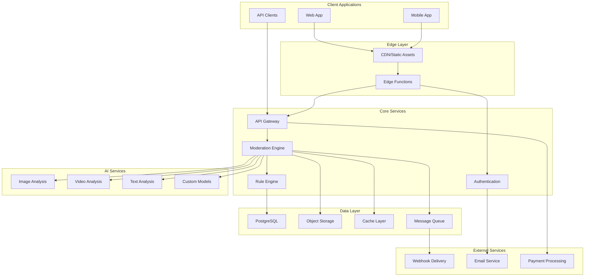
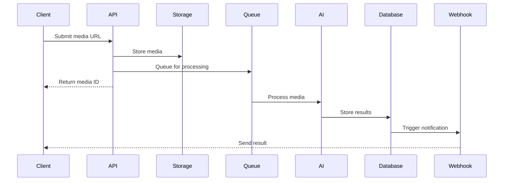
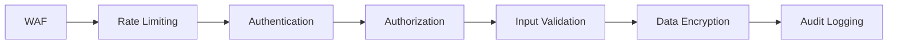

## System Overview

Pixel Patrol is built on a modern, scalable architecture designed for high-performance content moderation. The system leverages edge computing, serverless functions, and AI services to provide fast, reliable moderation at scale.

## Architecture Diagram



## Core Components

### Frontend Application

<CardGroup cols={2}>
  <Card title="Next.js Static Export" icon="react">
    - Server-side rendering at build time
    - Client-side hydration
    - Progressive Web App
    - Responsive design
  </Card>
  
  <Card title="Authentication" icon="lock">
    - JWT-based authentication
    - Secure session management
    - Multi-factor authentication
    - SSO integration ready
  </Card>
</CardGroup>

### Backend Services

#### Edge Functions

Serverless functions for core operations:

| Function | Purpose | Trigger |
|----------|---------|---------|
| `submit-media` | Accept media submissions | HTTP POST |
| `moderate-media` | Process moderation | Queue message |
| `webhook-notification` | Send webhooks | Event |
| `create-team` | Team management | HTTP POST |

#### Database Architecture

PostgreSQL with Row Level Security:

```sql
-- Example RLS policy
CREATE POLICY "Users can view their team's media"
ON media
FOR SELECT
TO authenticated
USING (team_id = auth.team_id());
```

### AI Pipeline

#### Processing Flow

1. **Media Ingestion**: Secure upload to object storage
2. **Preprocessing**: Format conversion, optimization
3. **AI Analysis**: Multi-model inference
4. **Rule Evaluation**: Apply configured rules
5. **Result Storage**: Database and cache
6. **Notification**: Webhooks and real-time updates

#### Model Architecture

```typescript
interface AIModel {
  id: string;
  type: 'image' | 'video' | 'text';
  version: string;
  capabilities: string[];
  performance: {
    latency: number; // ms
    accuracy: number; // 0-1
  };
}
```

## Data Flow

### Media Submission Flow



### Real-time Updates

WebSocket connections for live updates:
- Moderation status changes
- Queue position updates
- Team activity streams
- System notifications

## Scalability Design

### Horizontal Scaling

<CardGroup cols={2}>
  <Card title="Stateless Services" icon="server">
    - No server-side sessions
    - Distributed caching
    - Load balancer ready
    - Auto-scaling groups
  </Card>
  
  <Card title="Queue-Based Processing" icon="layer-group">
    - Asynchronous processing
    - Priority queues
    - Dead letter queues
    - Retry mechanisms
  </Card>
</CardGroup>

### Performance Optimization

#### Caching Strategy

Multi-layer caching:

1. **CDN**: Static assets, API responses
2. **Application Cache**: Frequently accessed data
3. **Database Cache**: Query result caching
4. **AI Result Cache**: Avoid duplicate processing

#### Database Optimization

- Indexed columns for fast queries
- Materialized views for analytics
- Connection pooling
- Read replicas for scaling

## Security Architecture

### Defense in Depth



### Security Measures

| Layer | Protection | Implementation |
|-------|------------|----------------|
| Network | DDoS protection | Cloudflare |
| Application | OWASP Top 10 | Security headers |
| API | Rate limiting | Token bucket |
| Data | Encryption | AES-256 |
| Access | RBAC | PostgreSQL RLS |

## Infrastructure

### Deployment Architecture

<Tabs>
  <Tab title="Production">
    ```yaml
    # Production configuration
    regions:
      - us-east-1 (primary)
      - eu-west-1 (secondary)
    
    services:
      api:
        instances: 10-50 (auto-scaling)
        cpu: 2 vCPU
        memory: 4GB
      
      ai:
        instances: 5-20 (GPU-enabled)
        gpu: NVIDIA T4
        memory: 16GB
      
      database:
        type: PostgreSQL 15
        instances: 1 primary, 2 replicas
        storage: 500GB SSD
    ```
  </Tab>
  
  <Tab title="Development">
    ```yaml
    # Development configuration
    services:
      all-in-one:
        type: Docker Compose
        resources:
          cpu: 2 vCPU
          memory: 8GB
          storage: 50GB
    ```
  </Tab>
</Tabs>

### Monitoring & Observability

Comprehensive monitoring stack:

- **Metrics**: Prometheus + Grafana
- **Logging**: ELK Stack
- **Tracing**: OpenTelemetry
- **Alerting**: PagerDuty
- **Status Page**: Public health monitoring

## Technology Stack

### Core Technologies

| Component | Technology | Purpose |
|-----------|------------|---------|
| Frontend | Next.js 14 | React framework |
| UI Library | Tailwind + ShadCN | Component system |
| Backend | Supabase | BaaS platform |
| Database | PostgreSQL 15 | Primary datastore |
| Storage | S3-compatible | Media storage |
| Queue | PostgreSQL Queue | Job processing |
| AI/ML | TensorFlow | Model serving |

### Development Tools

- **Version Control**: Git + GitHub
- **CI/CD**: GitHub Actions
- **Testing**: Jest + Playwright
- **Code Quality**: ESLint + Prettier
- **Documentation**: Mintlify

## Disaster Recovery

### Backup Strategy

- **Database**: Hourly snapshots, 30-day retention
- **Media Files**: Cross-region replication
- **Configuration**: Version controlled
- **Secrets**: Encrypted backup

### Recovery Procedures

| Scenario | RTO | RPO | Procedure |
|----------|-----|-----|-----------|
| Database failure | 30 min | 1 hour | Restore from snapshot |
| Region outage | 5 min | 0 min | Failover to secondary |
| Data corruption | 2 hours | 1 hour | Point-in-time recovery |

## Future Architecture

### Planned Improvements

1. **Edge AI Processing**: Deploy models closer to users
2. **Multi-Region Active-Active**: Global distribution
3. **GraphQL API**: Flexible data fetching
4. **Event Streaming**: Kafka integration
5. **Kubernetes Migration**: Container orchestration

## Related Topics

- [Installation](/installation) - Getting started
- [API Reference](/api-reference/introduction) - Technical details
- [Security Best Practices](/guides/security-best-practices) - Security guide