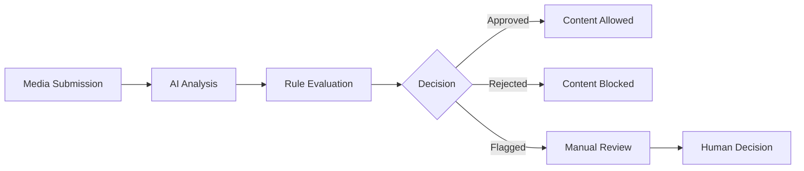

## Overview

Moderation is the core process of analyzing and filtering user-generated content. Pixel Patrol combines AI-powered analysis with rule-based decision making to provide flexible, accurate content moderation.

## Moderation Flow



## Submission Process

### Media Types Supported

<CardGroup cols={3}>
  <Card title="Images" icon="image">
    - JPEG, PNG, GIF
    - WebP, AVIF
    - Up to 50MB
  </Card>
  
  <Card title="Videos" icon="video">
    - MP4, WebM
    - MOV, AVI
    - Up to 200MB
  </Card>
  
  <Card title="Text" icon="text">
    - Plain text
    - Rich text
    - Up to 1MB
  </Card>
</CardGroup>

### Submission Methods

1. **API Submission**: Direct API calls with media URLs
2. **File Upload**: Direct file upload to storage
3. **Batch Processing**: Multiple items in one request

## AI Analysis

### Detection Categories

Pixel Patrol's AI analyzes content for:

- **Violence**: Graphic violence, gore, weapons
- **Adult Content**: Nudity, sexual content
- **Hate Speech**: Discriminatory content, symbols
- **Self-Harm**: Content promoting self-injury
- **Drugs**: Drug use or paraphernalia
- **Spam**: Repetitive or promotional content
- **Custom Labels**: Team-specific categories

### Confidence Scores

Each detection includes a confidence score (0-1):
- `0.0-0.3`: Low confidence
- `0.3-0.7`: Medium confidence
- `0.7-1.0`: High confidence

## Moderation Queue

### Queue Management

The moderation queue shows:
- Pending items awaiting review
- AI analysis results
- Applied rules and decisions
- Moderation history

### Filtering Options

- **Status**: Pending, Approved, Rejected, Flagged
- **Content Type**: Image, Video, Text
- **Date Range**: Custom time periods
- **Confidence**: Score thresholds
- **Labels**: Specific AI detections

## Manual Review

### When Manual Review Occurs

- Items flagged by rules
- Low AI confidence scores
- Content in gray areas
- Random sampling for quality

### Review Actions

Moderators can:
- **Approve**: Allow the content
- **Reject**: Block the content
- **Escalate**: Send to senior moderator
- **Re-moderate**: Trigger new AI analysis

## Moderation Results

### Result Structure

```json
{
  "id": "media_123",
  "status": "rejected",
  "ai_results": {
    "labels": [
      {
        "name": "violence",
        "confidence": 0.89
      }
    ]
  },
  "applied_rules": [
    {
      "rule_id": "rule_456",
      "rule_name": "Block Violence",
      "action": "reject"
    }
  ],
  "moderated_at": "2024-01-20T10:30:00Z",
  "moderator": "system"
}
```

### Webhook Notifications

Results are sent to configured webhooks:
```json
{
  "event": "media.moderated",
  "media_id": "media_123",
  "status": "rejected",
  "timestamp": "2024-01-20T10:30:00Z"
}
```

## Performance Metrics

### Key Metrics

- **Processing Time**: Average time from submission to decision
- **Accuracy Rate**: Correct decisions vs. manual overrides
- **False Positive Rate**: Safe content incorrectly blocked
- **False Negative Rate**: Harmful content incorrectly approved

### Monitoring Dashboard

Track moderation performance:
- Real-time processing stats
- Decision distribution
- Rule effectiveness
- AI accuracy metrics

## Best Practices

### Optimization Tips

1. **Rule Tuning**: Adjust thresholds based on results
2. **Regular Reviews**: Sample and verify decisions
3. **Feedback Loop**: Learn from manual overrides
4. **Balance Speed/Accuracy**: Configure for your needs

### Common Patterns

1. **Strict First**: Start with strict rules, then relax
2. **Category Focus**: Prioritize high-risk content types
3. **User Trust**: Consider user reputation in rules
4. **Time-Based**: Adjust rules for peak periods

## Related Concepts

- [AI Moderation](/features/ai-moderation) - AI capabilities in detail
- [Rules](/concepts/rules) - Rule configuration
- [Queue Management](/tutorials/media-moderation/review-queue) - Using the moderation queue