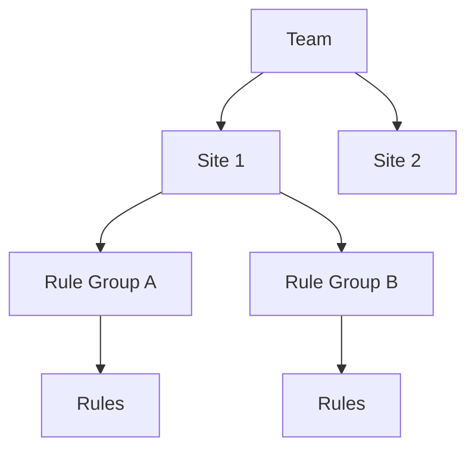

## Overview

Sites represent the websites or applications that submit media for moderation. Each site belongs to a team and has its own configuration, rules, and webhook settings.

## Site Configuration

### Basic Settings

Every site includes:

- **Name**: Display name for the site
- **URL**: Primary website URL
- **Description**: AI-generated or custom description
- **Site Key**: Unique key for authentication

### Webhook Configuration

Sites can receive moderation results via webhooks:

- **Webhook URL**: Endpoint to receive notifications
- **Webhook Secret**: Shared secret for request verification
- **Retry Logic**: Automatic retry on failure

## Site Hierarchy



## API Integration

Sites submit media for moderation using their site key:

```bash
curl -X POST https://api.pixelpatrol.net/functions/v1/submit-media \
  -H "Content-Type: application/json" \
  -d '{
    "api_key": "site_xxxxxxxxxxxxxxxxxxxx",
    "content_url": "https://example.com/image.jpg",
    "app_media_id": "unique-media-123",
    "metadata": {}
  }'
```

## Rule Assignment

Sites can have multiple rule groups:

- Rule groups contain individual moderation rules
- Rules are evaluated in priority order
- First matching rule determines the action

## Site Management

### Creating a Site

1. Navigate to the Sites page
2. Click "Create Site"
3. Enter site details
4. Configure webhook settings (optional)
5. Save and receive API credentials

### Monitoring Site Activity

- View moderation statistics
- Check webhook delivery status
- Monitor API usage
- Review moderation history

## Security

### Site Key Security

- Store site keys securely
- Rotate keys periodically
- Never expose keys in client-side code
- Use environment variables

### Webhook Security

- Verify webhook signatures
- Use HTTPS endpoints only
- Implement request timeouts
- Log webhook attempts

## Best Practices

1. **Descriptive Naming**: Use clear, identifiable site names
2. **Rule Organization**: Group related rules logically
3. **Webhook Reliability**: Implement proper error handling
4. **Regular Monitoring**: Check webhook logs and delivery status

## Related Concepts

- [Rules](/concepts/rules) - Moderation rules for sites
- [Webhooks](/concepts/webhooks) - Webhook notifications
- [API Reference](/api-reference/introduction) - Complete API documentation
