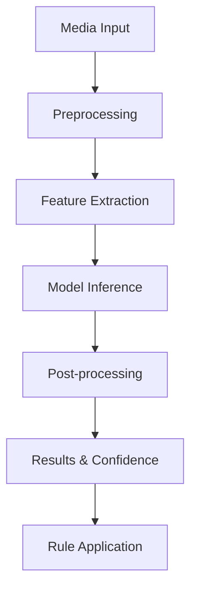

## Overview

Pixel Patrol's AI moderation uses state-of-the-art machine learning models to analyze images, videos, and text for potentially harmful content. Our AI provides detailed analysis with confidence scores, enabling accurate and nuanced moderation decisions.

## AI Capabilities

### Content Analysis

<CardGroup cols={2}>
  <Card title="Visual Analysis" icon="eye">
    - Object detection
    - Scene understanding
    - Text extraction (OCR)
    - Face detection
    - Brand/logo recognition
  </Card>
  
  <Card title="Context Understanding" icon="lightbulb">
    - Semantic analysis
    - Context awareness
    - Cultural sensitivity
    - Sarcasm detection
    - Intent classification
  </Card>
</CardGroup>

### Detection Categories

Our AI models detect multiple content categories:

| Category | Description | Confidence Range |
|----------|-------------|------------------|
| Violence | Graphic violence, weapons, gore | 0.0 - 1.0 |
| Adult | Nudity, sexual content | 0.0 - 1.0 |
| Hate | Discriminatory content, hate symbols | 0.0 - 1.0 |
| Self-Harm | Content promoting self-injury | 0.0 - 1.0 |
| Drugs | Drug use, paraphernalia | 0.0 - 1.0 |
| Spam | Promotional, repetitive content | 0.0 - 1.0 |
| Bullying | Harassment, cyberbullying | 0.0 - 1.0 |
| Misinformation | False or misleading content | 0.0 - 1.0 |

## How It Works

### Processing Pipeline



### Model Architecture

1. **Multi-Modal Analysis**: Separate models for different content types
2. **Ensemble Approach**: Multiple models vote for accuracy
3. **Continuous Learning**: Models improve from feedback
4. **Edge Deployment**: Fast, privacy-focused processing

## Configuration

### AI Settings

Configure AI behavior per site or globally:

```json
{
  "ai_config": {
    "enabled": true,
    "models": ["violence", "adult", "hate"],
    "confidence_threshold": 0.7,
    "language_models": ["en", "es", "fr"],
    "custom_labels": ["brand_safety", "competitor_content"]
  }
}
```

### Confidence Thresholds

Adjust sensitivity for different use cases:

- **High Sensitivity** (0.3-0.5): Catches more content, more false positives
- **Balanced** (0.5-0.7): Good for most applications
- **Low Sensitivity** (0.7-0.9): Fewer false positives, may miss edge cases

## Custom AI Models

### Training Custom Models

Pixel Patrol supports custom AI models for specific use cases:

1. **Data Collection**: Gather labeled training data
2. **Model Training**: Train on your specific content
3. **Validation**: Test accuracy and performance
4. **Deployment**: Deploy to production

### Use Cases

- **Brand Safety**: Detect competitor logos or products
- **Community Standards**: Enforce specific community guidelines
- **Industry-Specific**: Medical, legal, or financial content
- **Regional Content**: Culturally specific moderation

## Performance

### Speed Metrics

| Content Type | Average Processing Time | Throughput |
|--------------|------------------------|------------|
| Image (< 5MB) | 200-500ms | 1000/min |
| Video (< 50MB) | 2-5 seconds | 100/min |
| Text (< 10KB) | 50-100ms | 5000/min |

### Accuracy Metrics

- **Precision**: 94% average across categories
- **Recall**: 91% average across categories
- **F1 Score**: 0.925 overall
- **False Positive Rate**: < 5%

## Advanced Features

### Multi-Language Support

AI moderation supports 50+ languages:
- Automatic language detection
- Language-specific models
- Cross-language hate speech detection
- Multilingual text extraction

### Contextual Analysis

Beyond simple label detection:
- **Artistic Context**: Distinguishes art from explicit content
- **Medical Context**: Recognizes educational content
- **News Context**: Understands journalistic content
- **Satire Detection**: Identifies humorous intent

### Batch Processing

Process multiple items efficiently:

```typescript
const results = await moderateBatch([
  { url: 'image1.jpg', type: 'image' },
  { url: 'video1.mp4', type: 'video' },
  { content: 'Text to analyze', type: 'text' }
]);
```

## Integration

### API Usage

```typescript
// Submit for AI moderation
const response = await fetch('/api/moderate', {
  method: 'POST',
  headers: {
    'Authorization': `Bearer ${API_KEY}`,
    'Content-Type': 'application/json'
  },
  body: JSON.stringify({
    url: 'https://example.com/image.jpg',
    type: 'image',
    ai_options: {
      models: ['violence', 'adult'],
      include_ocr: true
    }
  })
});
```

### Real-time Moderation

For live content streams:
- WebSocket connections
- Frame sampling for videos
- Incremental text analysis
- Priority queue processing

## Best Practices

### Optimization

1. **Right-size Media**: Compress before submission
2. **Batch When Possible**: Group related content
3. **Cache Results**: Avoid re-processing identical content
4. **Monitor Performance**: Track processing times

### Accuracy Improvement

1. **Provide Context**: Include metadata when available
2. **Use Feedback**: Report false positives/negatives
3. **Combine with Rules**: Layer AI with business rules
4. **Regular Reviews**: Audit AI decisions periodically

## Limitations

### Known Limitations

- **Context Ambiguity**: May struggle with highly contextual content
- **New Trends**: Requires updates for emerging content types
- **Cultural Nuance**: May need region-specific tuning
- **Adversarial Content**: Can be fooled by intentional manipulation

### Mitigation Strategies

1. **Human Review**: Flag uncertain content for manual review
2. **Continuous Training**: Regular model updates
3. **Feedback Loop**: Learn from moderation decisions
4. **Multiple Signals**: Combine AI with other indicators

## Related Topics

- [Rule-Based Moderation](/features/rule-based-moderation) - Combining AI with rules
- [Moderation Concepts](/concepts/moderation) - Overall moderation flow
- [API Reference](/api-reference/media/moderate) - Technical API details