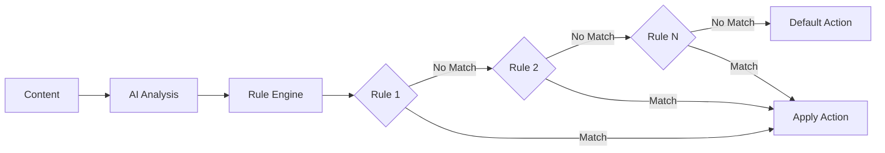

## Overview

Rule-based moderation allows you to define custom logic for content filtering. Combined with AI analysis, rules provide precise control over moderation decisions based on your specific requirements.

## Rule Engine

### How Rules Work

The rule engine evaluates content through a series of conditions:



### Rule Components

Each rule consists of:

| Component | Description | Example |
|-----------|-------------|---------|
| **Conditions** | What to check | `ai.violence.confidence > 0.8` |
| **Actions** | What to do | `reject`, `approve`, `flag` |
| **Priority** | Execution order | `100` (lower = higher priority) |
| **Metadata** | Additional context | `{reason: "High violence"}` |

## Rule Types

### AI-Based Rules

Leverage AI analysis results:

```json
{
  "name": "Block High-Confidence Violence",
  "type": "ai_analysis",
  "conditions": {
    "ai.violence.confidence": { ">=": 0.8 }
  },
  "action": "reject"
}
```

### Metadata Rules

Check content metadata:

```json
{
  "name": "Auto-Approve Verified Users",
  "type": "metadata",
  "conditions": {
    "user.verified": true,
    "user.trust_score": { ">=": 0.9 }
  },
  "action": "approve"
}
```

### Composite Rules

Combine multiple conditions:

```json
{
  "name": "Complex Content Filter",
  "type": "composite",
  "conditions": {
    "OR": [
      {
        "AND": [
          {"ai.adult.confidence": { ">=": 0.7 }},
          {"metadata.context": { "!=": "educational" }}
        ]
      },
      {"ai.violence.confidence": { ">=": 0.9 }}
    ]
  },
  "action": "reject"
}
```

### Time-Based Rules

Apply rules based on time:

```json
{
  "name": "Weekend Strict Moderation",
  "type": "temporal",
  "conditions": {
    "time.day_of_week": { "in": ["saturday", "sunday"] },
    "ai.any.confidence": { ">=": 0.5 }
  },
  "action": "flag"
}
```

## Rule Groups

### Organization

Rules are organized into groups for better management:

```typescript
interface RuleGroup {
  id: string;
  name: string;
  description: string;
  priority: number;
  active: boolean;
  rules: Rule[];
}
```

### Group Priority

Groups execute in priority order:
1. **Security Rules** (Priority: 0)
2. **Content Policy** (Priority: 100)
3. **Community Guidelines** (Priority: 200)
4. **Quality Standards** (Priority: 300)

## Advanced Features

### Rule Variables

Use dynamic values in rules:

| Variable | Description | Example Usage |
|----------|-------------|---------------|
| `{{site.id}}` | Current site ID | Site-specific rules |
| `{{user.country}}` | User's country | Geo-based filtering |
| `{{time.hour}}` | Current hour (0-23) | Time-based rules |
| `{{media.size}}` | File size in bytes | Size restrictions |

### Rule Functions

Built-in functions for complex logic:

```json
{
  "conditions": {
    "custom.contains_keywords": {
      "function": "text_contains_any",
      "params": ["spam", "advertisement", "promotion"]
    }
  }
}
```

### Rule Templates

Pre-built templates for common scenarios:

<CardGroup cols={2}>
  <Card title="COPPA Compliance" icon="child">
    Rules for child safety compliance
  </Card>
  
  <Card title="Brand Safety" icon="shield">
    Protect brand reputation
  </Card>
  
  <Card title="Community Standards" icon="users">
    Enforce community guidelines
  </Card>
  
  <Card title="Legal Compliance" icon="gavel">
    Meet regulatory requirements
  </Card>
</CardGroup>

## Rule Creation

### Visual Rule Builder

Create rules without coding:

1. Select trigger conditions
2. Add logical operators (AND/OR)
3. Set confidence thresholds
4. Choose actions
5. Test with sample content

### Code-Based Rules

For complex logic:

```typescript
const rule: Rule = {
  name: "Advanced Content Filter",
  evaluate: (content: Content) => {
    const hasViolence = content.ai.violence?.confidence > 0.7;
    const isNewsContext = content.metadata.source === 'news';
    const isVerifiedJournalist = content.user.role === 'journalist';
    
    if (hasViolence && !isNewsContext && !isVerifiedJournalist) {
      return { action: 'reject', reason: 'Violence outside news context' };
    }
    
    return null; // No match
  }
};
```

## Testing & Validation

### Rule Testing

Test rules before deployment:

```typescript
// Test rule against sample content
const testResults = await testRule(rule, [
  { url: 'sample1.jpg', expectedAction: 'approve' },
  { url: 'sample2.jpg', expectedAction: 'reject' }
]);
```

### Simulation Mode

Run rules without applying actions:
- See which rules would trigger
- Review decision explanations
- Identify conflicts or gaps
- Fine-tune thresholds

## Performance Optimization

### Best Practices

1. **Order by Frequency**: Most common rules first
2. **Early Exit**: Reject obvious violations quickly
3. **Minimal Conditions**: Simpler rules execute faster
4. **Cache Results**: Reuse expensive computations

### Performance Metrics

| Metric | Target | Typical |
|--------|--------|---------|
| Rule Evaluation Time | < 10ms | 2-5ms |
| Rules per Second | > 10,000 | 25,000 |
| Memory Usage | < 100MB | 50MB |

## Monitoring & Analytics

### Rule Analytics

Track rule effectiveness:
- **Hit Rate**: How often each rule triggers
- **Override Rate**: Manual overrides of rule decisions
- **Processing Time**: Performance of each rule
- **False Positive Rate**: Incorrect rejections

### Dashboard Metrics

```typescript
interface RuleMetrics {
  ruleId: string;
  triggerCount: number;
  avgProcessingTime: number;
  overrideCount: number;
  lastTriggered: Date;
}
```

## Integration Examples

### E-commerce Platform

```json
{
  "name": "Product Review Filter",
  "conditions": {
    "OR": [
      {"ai.spam.confidence": { ">=": 0.8 }},
      {"text.contains_competitor": true},
      {"user.review_count": { "<": 5 }, "text.contains_url": true}
    ]
  },
  "action": "flag"
}
```

### Social Media

```json
{
  "name": "Community Guidelines",
  "conditions": {
    "AND": [
      {"ai.bullying.confidence": { ">=": 0.6 }},
      {"user.previous_violations": { ">": 2 }}
    ]
  },
  "action": "reject",
  "metadata": {
    "notify_user": true,
    "escalate_to_admin": true
  }
}
```

## Related Topics

- [Rules Concept](/concepts/rules) - Understanding rules
- [AI Moderation](/features/ai-moderation) - AI integration
- [Rule Configuration](/tutorials/rules-and-filtering/configuring-rules) - Setup guide