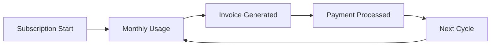

## Overview

Pixel Patrol offers flexible subscription plans designed to scale with your content moderation needs. Each team has its own subscription, allowing organizations to manage multiple projects with different requirements.

## Subscription Plans

### Available Plans

<CardGroup cols={3}>
  <Card title="Free" icon="gift">
    **$0/month**
    - 1,000 moderations/month
    - 1 site
    - 2 team members
    - Basic support
    - Community features
  </Card>
  
  <Card title="Pro" icon="star">
    **$49/month**
    - 10,000 moderations/month
    - 10 sites
    - 10 team members
    - Priority support
    - Advanced analytics
    - Webhook notifications
  </Card>
  
  <Card title="Enterprise" icon="building">
    **Custom pricing**
    - Unlimited moderations
    - Unlimited sites
    - Unlimited members
    - Dedicated support
    - Custom AI models
    - SLA guarantees
  </Card>
</CardGroup>

### Feature Comparison

| Feature | Free | Pro | Enterprise |
|---------|------|-----|------------|
| Moderations/month | 1,000 | 10,000 | Unlimited |
| Sites | 1 | 10 | Unlimited |
| Team members | 2 | 10 | Unlimited |
| AI models | Basic | All | Custom |
| API rate limit | 100/min | 1,000/min | Custom |
| Data retention | 30 days | 90 days | Custom |
| Support | Community | Priority | Dedicated |
| SLA | None | 99.9% | 99.99% |

## Usage & Limits

### Usage Tracking

Monitor your team's usage in real-time:

```typescript
const usage = await getTeamUsage(teamId);
{
  moderations: {
    used: 7,234,
    limit: 10,000,
    resetDate: "2024-02-01"
  },
  storage: {
    used: 3.2, // GB
    limit: 10.0
  },
  apiCalls: {
    used: 45,678,
    limit: 100,000
  }
}
```

### Limit Types

<CardGroup cols={2}>
  <Card title="Soft Limits" icon="cloud">
    - Moderations per month
    - API calls per month
    - Storage space
    - Warning at 80%
  </Card>
  
  <Card title="Hard Limits" icon="stop">
    - Team members
    - Sites
    - Concurrent requests
    - Immediate enforcement
  </Card>
</CardGroup>

### Overage Handling

When limits are exceeded:

1. **Soft Limits**: 
   - Email notifications at 80%, 90%, 100%
   - Grace period for upgrades
   - Automatic upgrade options

2. **Hard Limits**:
   - Immediate blocking
   - Upgrade required
   - No service interruption for existing content

## Billing Management

### Payment Methods

Supported payment options:
- Credit/debit cards (Visa, Mastercard, Amex)
- ACH bank transfers (Enterprise)
- Invoicing (Enterprise)
- Annual prepayment discounts

### Billing Cycle



### Invoice Details

Monthly invoices include:
- Base subscription fee
- Overage charges (if applicable)
- Add-on services
- Credits or discounts
- Tax (where applicable)

## Subscription Management

### Upgrading Plans

Upgrade anytime with immediate effect:

```typescript
// Upgrade to Pro plan
await upgradeSubscription({
  teamId: 'team_123',
  planId: 'pro',
  billingPeriod: 'monthly'
});
```

Benefits of upgrading:
- Immediate limit increases
- Pro-rated billing
- No service interruption
- Keep all data and settings

### Downgrading Plans

Downgrade at end of billing cycle:
- Current limits until cycle end
- Data retention per new plan
- Automatic feature adjustment
- Warning if over new limits

### Cancellation

Cancel anytime:
- Service until cycle end
- Data export available
- 30-day data retention
- Reactivation possible

## Add-On Services

### Available Add-Ons

<CardGroup cols={2}>
  <Card title="Extra Moderations" icon="plus">
    - 10,000 pack: $20
    - 50,000 pack: $75
    - 100,000 pack: $125
    - Never expire
  </Card>
  
  <Card title="Priority Processing" icon="rocket">
    - 2x faster processing
    - Dedicated queue
    - $99/month
    - Cancel anytime
  </Card>
  
  <Card title="Extended Retention" icon="clock">
    - 180-day retention: $19/mo
    - 365-day retention: $39/mo
    - Compliance support
    - Searchable archive
  </Card>
  
  <Card title="Custom AI Training" icon="brain">
    - Train on your data
    - Private models
    - Starting at $499
    - One-time setup
  </Card>
</CardGroup>

## Enterprise Features

### Custom Contracts

Enterprise plans include:
- Volume discounts
- Custom terms
- Flexible payments
- Dedicated account manager

### SLA Guarantees

| Metric | Pro SLA | Enterprise SLA |
|--------|---------|----------------|
| Uptime | 99.9% | 99.99% |
| API Response | < 500ms | < 200ms |
| Support Response | 24 hours | 1 hour |
| Moderation Time | < 5 seconds | < 2 seconds |

### Compliance

Enterprise compliance features:
- SOC 2 Type II certified
- GDPR compliant
- HIPAA ready
- Custom data residency
- Audit logs
- BAA available

## Cost Optimization

### Best Practices

1. **Right-Size Your Plan**: Monitor usage patterns
2. **Use Rules Efficiently**: Reduce unnecessary API calls
3. **Batch Processing**: Group related content
4. **Cache Results**: Avoid duplicate processing

### Usage Analytics

Track spending patterns:

```typescript
const analytics = await getBillingAnalytics(teamId);
{
  monthlySpend: [120, 135, 128, 142],
  topCostDrivers: {
    moderations: 65,
    storage: 20,
    addOns: 15
  },
  projectedCost: 155
}
```

## Payment Security

### Security Measures

- PCI DSS Level 1 compliant
- Tokenized card storage
- 3D Secure authentication
- Encrypted transactions
- No card data stored

### Billing Portal

Self-service portal features:
- View invoices
- Update payment methods
- Change plans
- Download receipts
- Manage tax information

## Discounts & Credits

### Available Discounts

- **Annual Plans**: 20% off
- **Non-Profit**: 50% off
- **Education**: 50% off
- **Startups**: Special pricing
- **Volume**: Enterprise negotiable

### Referral Program

Earn credits:
- $25 credit per referral
- Referred team gets $25 credit
- No limit on referrals
- Credits never expire

## FAQ

### Common Questions

<AccordionGroup>
  <Accordion title="Can I change plans anytime?">
    Yes, upgrade immediately or downgrade at cycle end.
  </Accordion>
  
  <Accordion title="What happens if I exceed limits?">
    Soft limits have grace periods, hard limits block immediately.
  </Accordion>
  
  <Accordion title="Do unused moderations roll over?">
    No, monthly allocations reset. Consider add-on packs for flexibility.
  </Accordion>
  
  <Accordion title="Can I get a refund?">
    Pro-rated refunds available for annual plans within 30 days.
  </Accordion>
</AccordionGroup>

## Related Topics

- [Teams](/concepts/teams) - Team-based billing
- [Getting Started](/quickstart) - Initial setup
- [API Usage](/api-reference/rate-limits) - Understanding API limits