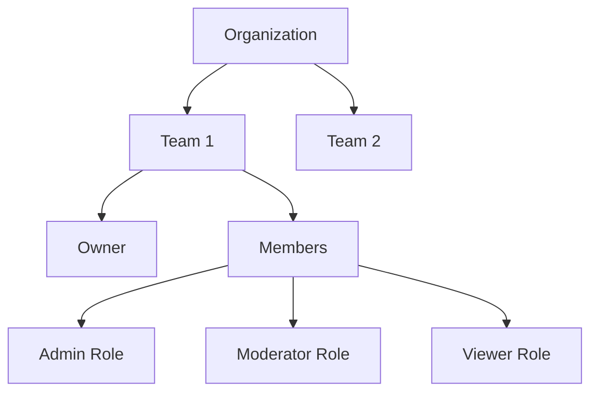

## Overview

Team management in Pixel Patrol enables organizations to collaborate effectively on content moderation. With role-based access control, invitation systems, and team switching, you can manage moderators, administrators, and other team members efficiently.

## Team Structure

### Team Hierarchy



### Team Components

<CardGroup cols={2}>
  <Card title="Team Profile" icon="id-card">
    - Team name and description
    - Creation date
    - Member count
    - Subscription status
  </Card>
  
  <Card title="Team Settings" icon="gear">
    - Default moderation rules
    - Notification preferences
    - Integration settings
    - Billing information
  </Card>
</CardGroup>

## Roles & Permissions

### Available Roles

| Role | Description | Key Permissions |
|------|-------------|-----------------|
| **Owner** | Team creator/admin | Full access, billing, delete team |
| **Admin** | Senior moderator | Manage members, sites, rules |
| **Moderator** | Content reviewer | Review queue, moderate content |
| **Viewer** | Read-only access | View analytics, logs |

### Permission Matrix

| Action | Owner | Admin | Moderator | Viewer |
|--------|-------|-------|-----------|--------|
| Create sites | ✅ | ✅ | ❌ | ❌ |
| Manage rules | ✅ | ✅ | ❌ | ❌ |
| Moderate content | ✅ | ✅ | ✅ | ❌ |
| View analytics | ✅ | ✅ | ✅ | ✅ |
| Invite members | ✅ | ✅ | ❌ | ❌ |
| Manage billing | ✅ | ❌ | ❌ | ❌ |

## Member Management

### Inviting Members

Send invitations via email:

```typescript
const invitation = await inviteTeamMember({
  email: 'moderator@example.com',
  role: 'moderator',
  teamId: 'team_123',
  customMessage: 'Welcome to our moderation team!'
});
```

### Invitation Flow

1. **Send Invitation**: Email with secure link
2. **Accept Invitation**: New or existing user
3. **Role Assignment**: Automatic permissions
4. **Team Access**: Immediate availability

### Managing Members

<CardGroup cols={2}>
  <Card title="Add Members" icon="user-plus">
    - Send email invitations
    - Set initial roles
    - Bulk invite options
    - Custom welcome messages
  </Card>
  
  <Card title="Update Roles" icon="user-pen">
    - Change member roles
    - Adjust permissions
    - Temporary access
    - Role history tracking
  </Card>
  
  <Card title="Remove Members" icon="user-minus">
    - Revoke access immediately
    - Transfer ownership
    - Archive member data
    - Audit trail
  </Card>
  
  <Card title="Member Activity" icon="chart-line">
    - Login history
    - Actions performed
    - Performance metrics
    - Time tracking
  </Card>
</CardGroup>

## Team Switching

### Multi-Team Support

Users can belong to multiple teams:

```typescript
// Get user's teams
const teams = await getUserTeams(userId);

// Switch active team
await switchTeam(teamId);

// Team context in requests
const media = await getMedia({ 
  teamId: currentTeam.id 
});
```

### Team Context

All operations respect team context:
- Data isolation between teams
- Separate billing per team
- Independent settings
- Isolated moderation queues

## Team Creation

### Automatic Team Creation

Teams are created automatically when:
1. A new user signs up (they become the owner of their personal team)
2. Users are invited to join existing teams

### Initial Setup

After a team is created:
1. **First Site**: Create your initial site for moderation
2. **Invite Members**: Build your team by inviting collaborators
3. **Configure Rules**: Set up moderation policies for your content
4. **Subscription**: Choose a plan that fits your needs

## Advanced Features

### Team Templates

Pre-configured team setups:

<CardGroup cols={2}>
  <Card title="E-commerce" icon="shopping-cart">
    Product review moderation setup
  </Card>
  
  <Card title="Social Media" icon="share-nodes">
    Community content moderation
  </Card>
  
  <Card title="Gaming" icon="gamepad">
    Player chat and content filtering
  </Card>
  
  <Card title="Enterprise" icon="building">
    Corporate compliance setup
  </Card>
</CardGroup>

### Team Analytics

Track team performance:

```typescript
interface TeamAnalytics {
  totalModerated: number;
  avgResponseTime: number;
  accuracyRate: number;
  memberActivity: {
    [memberId: string]: {
      itemsModerated: number;
      avgTime: number;
      accuracy: number;
    }
  };
}
```

### Audit Logs

Comprehensive activity tracking:
- Member actions
- Permission changes
- Setting modifications
- Access logs

## Billing & Subscriptions

### Team-Based Billing

Each team has independent billing:
- Separate subscriptions
- Usage tracking
- Invoice management
- Payment methods

### Usage Limits

Monitor team usage:
```typescript
const usage = await getTeamUsage(teamId);
// {
//   moderations: { used: 8500, limit: 10000 },
//   storage: { used: 2.5, limit: 10 }, // GB
//   members: { active: 5, limit: 10 }
// }
```

## Best Practices

### Team Organization

1. **Clear Naming**: Use descriptive team names
2. **Role Assignment**: Follow least privilege principle
3. **Regular Reviews**: Audit member access
4. **Documentation**: Document team processes

### Security

1. **Access Control**: Regular permission audits
2. **Invitation Management**: Monitor pending invites
3. **Activity Monitoring**: Track unusual behavior
4. **Data Separation**: Ensure team isolation

### Scalability

1. **Sub-Teams**: Organize large teams
2. **Automation**: Use API for management
3. **Templates**: Standardize configurations
4. **Training**: Onboard new members effectively

## Integration

### SSO Integration

Connect with identity providers:
- SAML 2.0 support
- OAuth integration
- Active Directory sync
- Automatic provisioning

### API Management

Programmatic team management:

```typescript
// List team members
const members = await pixelPatrol.teams.listMembers(teamId);

// Update member role
await pixelPatrol.teams.updateMember(teamId, memberId, {
  role: 'admin'
});

// Remove member
await pixelPatrol.teams.removeMember(teamId, memberId);
```

## Troubleshooting

### Common Issues

| Issue | Solution |
|-------|----------|
| Can't invite members | Check team member limits |
| Permission denied | Verify role permissions |
| Team not found | Ensure correct team context |
| Billing issues | Check subscription status |

### Support Resources

- Team setup guides
- Role configuration help
- Billing documentation
- API reference

## Related Topics

- [Teams Concept](/concepts/teams) - Understanding teams
- [Creating Teams](/tutorials/team-management/creating-teams) - Setup guide
- [Managing Roles](/tutorials/team-management/managing-roles) - Role configuration