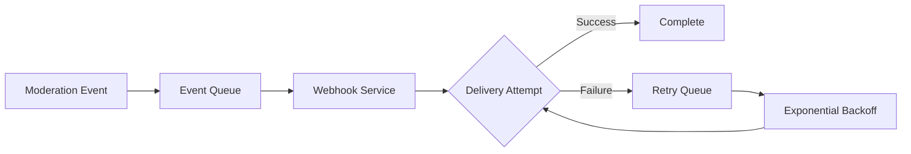

## Overview

Webhook notifications enable real-time communication between Pixel Patrol and your application. Get instant updates on moderation decisions, system events, and more with our reliable webhook delivery system.

## Webhook System

### Architecture



### Key Features

<CardGroup cols={2}>
  <Card title="Reliable Delivery" icon="rotate">
    - Automatic retries with exponential backoff
    - At-least-once delivery guarantee
    - Dead letter queue for failed deliveries
  </Card>
  
  <Card title="Security" icon="lock">
    - HMAC-SHA256 signature verification
    - TLS/SSL required endpoints
    - IP allowlisting support
  </Card>
  
  <Card title="Performance" icon="bolt">
    - Sub-second delivery times
    - Parallel processing
    - Rate limiting protection
  </Card>
  
  <Card title="Monitoring" icon="chart-line">
    - Detailed delivery logs
    - Success/failure metrics
    - Latency tracking
  </Card>
</CardGroup>

## Event Types

### Available Events

| Event | Description | Payload |
|-------|-------------|---------|
| `media.created` | New media submitted | Media ID, site ID, status, timestamps |
| `media.moderated` | Moderation complete | Status, AI results, rule evaluations |
| `test.webhook` | Test webhook | Test data for verification |

## Implementation

### Webhook Endpoint

Your webhook endpoint should:

```typescript
app.post('/webhooks/pixel-patrol', async (req, res) => {
  // 1. Verify signature
  const signature = req.headers['x-pixelpatrol-signature'];
  const timestamp = req.headers['x-pixelpatrol-timestamp'];
  const event = req.headers['x-pixelpatrol-event'];
  
  if (!verifySignature(req.body, signature, timestamp)) {
    return res.status(401).json({ error: 'Invalid signature' });
  }
  
  // 2. Parse event
  const event = JSON.parse(req.body);
  
  // 3. Process asynchronously
  await queue.add('process-webhook', event);
  
  // 4. Respond quickly
  res.status(200).json({ received: true });
});
```

### Signature Verification

```typescript
import { createHmac } from 'crypto';

function verifySignature(
  payload: string,
  signature: string,
  timestamp: string,
  secret: string
): boolean {
  // Check timestamp to prevent replay attacks
  const currentTime = Date.now();
  const webhookTime = parseInt(timestamp);
  if (Math.abs(currentTime - webhookTime) > 300000) { // 5 minutes
    return false;
  }
  
  const expectedSignature = createHmac('sha256', secret)
    .update(payload)
    .digest('hex');
  
  return expectedSignature === signature;
}
```

## Delivery & Reliability

### Retry Strategy

Failed webhooks are retried with exponential backoff:

| Attempt | Delay | Total Time |
|---------|-------|------------|
| 1 | Immediate | 0s |
| 2 | 1 minute | 1m |
| 3 | 5 minutes | 6m |
| 4 | 30 minutes | 36m |
| 5 | 2 hours | 2h 36m |

### Failure Scenarios

Webhooks are considered failed when:
- HTTP status code is not 2xx
- Connection timeout (30 seconds)
- SSL/TLS errors
- DNS resolution failures

### Dead Letter Queue

After all retries fail:
1. Event moved to dead letter queue
2. Admin notification sent
3. Manual retry available
4. 30-day retention

## Advanced Features

### Batch Webhooks

Receive multiple events in one request:

```json
{
  "batch_id": "batch_123",
  "events": [
    {
      "id": "event_1",
      "event": "media.moderated",
      "data": { /* ... */ }
    },
    {
      "id": "event_2",
      "event": "media.moderated",
      "data": { /* ... */ }
    }
  ]
}
```

### Webhook Filters

Configure which events to receive:

```json
{
  "filters": {
    "events": ["media.moderated"],
    "status": ["rejected", "flagged"],
    "confidence": { ">=": 0.8 }
  }
}
```

### Custom Headers

Add custom headers to webhook requests:

```json
{
  "custom_headers": {
    "X-API-Key": "your-api-key",
    "X-Environment": "production"
  }
}
```

## Monitoring & Debugging

### Webhook Logs

Detailed logs for each delivery attempt:

```json
{
  "webhook_id": "wh_123",
  "attempt": 1,
  "url": "https://api.example.com/webhook",
  "status": 200,
  "duration_ms": 245,
  "response_body": "OK",
  "headers": {
    "x-request-id": "req_456"
  }
}
```

### Health Monitoring

Track webhook health metrics:
- **Success Rate**: Percentage of successful deliveries
- **Average Latency**: Time to deliver
- **Queue Depth**: Pending webhooks
- **Error Rate**: Failed delivery percentage

### Testing Tools

<CardGroup cols={2}>
  <Card title="Test Endpoint" icon="vial">
    Send test webhooks to verify setup
  </Card>
  
  <Card title="Webhook Inspector" icon="magnifying-glass">
    View recent deliveries and payloads
  </Card>
  
  <Card title="Replay Events" icon="rotate-right">
    Resend historical events
  </Card>
  
  <Card title="Mock Server" icon="server">
    Test against simulated endpoints
  </Card>
</CardGroup>

## Best Practices

### Endpoint Implementation

1. **Quick Response**: Return 200 immediately
2. **Async Processing**: Use queues for heavy work
3. **Idempotency**: Handle duplicate events
4. **Error Handling**: Graceful failure recovery

### Security

1. **Always Verify**: Check signatures on every request
2. **Use HTTPS**: Never use plain HTTP
3. **Validate Payloads**: Sanitize input data
4. **Rate Limit**: Protect against floods

### Reliability

1. **Handle Retries**: Expect duplicate deliveries
2. **Monitor Health**: Track success rates
3. **Plan for Failures**: Implement fallbacks
4. **Keep Logs**: Retain for debugging

## Troubleshooting

### Common Issues

| Issue | Cause | Solution |
|-------|-------|----------|
| No webhooks received | Incorrect URL | Verify endpoint configuration |
| Signature failures | Wrong secret | Check webhook secret |
| Timeouts | Slow processing | Implement async handling |
| Duplicate events | Retry mechanism | Use idempotency keys |

### Debug Checklist

- [ ] Endpoint returns 2xx status
- [ ] Signature verification working
- [ ] SSL certificate valid
- [ ] No firewall blocking
- [ ] Correct event types selected
- [ ] Webhook enabled in settings

## Integration Examples

### Node.js/Express

```typescript
import express from 'express';
import { verifyWebhook } from '@pixelpatrol/webhooks';

const app = express();

app.post('/webhooks', 
  express.raw({ type: 'application/json' }),
  async (req, res) => {
    try {
      const event = verifyWebhook(req.body, req.headers);
      await processEvent(event);
      res.sendStatus(200);
    } catch (error) {
      console.error('Webhook error:', error);
      res.sendStatus(400);
    }
  }
);
```

### Python/Flask

```python
from flask import Flask, request
import hmac
import hashlib

app = Flask(__name__)

@app.route('/webhooks', methods=['POST'])
def handle_webhook():
    # Verify signature
    signature = request.headers.get('X-Webhook-Signature')
    expected = 'sha256=' + hmac.new(
        WEBHOOK_SECRET.encode(),
        request.data,
        hashlib.sha256
    ).hexdigest()
    
    if signature != expected:
        return 'Unauthorized', 401
    
    # Process event
    event = request.json
    process_event.delay(event)  # Celery task
    
    return 'OK', 200
```

## Related Topics

- [Webhooks Concept](/concepts/webhooks) - Core webhook concepts
- [Webhook API](/api-reference/webhooks/overview) - API reference
- [Setting Up Webhooks](/tutorials/webhooks-and-api/setting-up-webhooks) - Setup guide